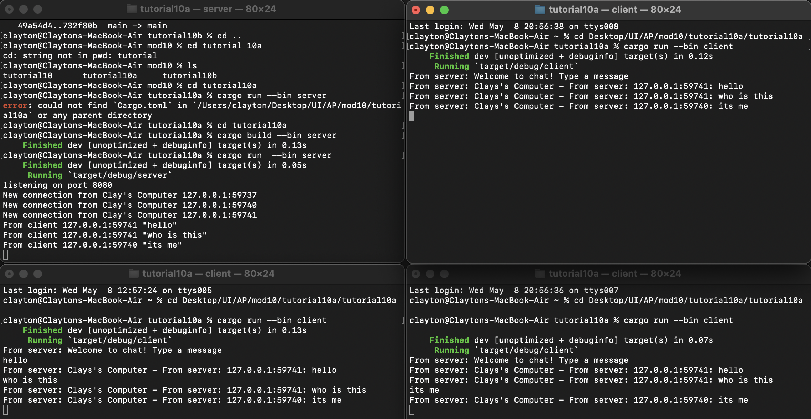
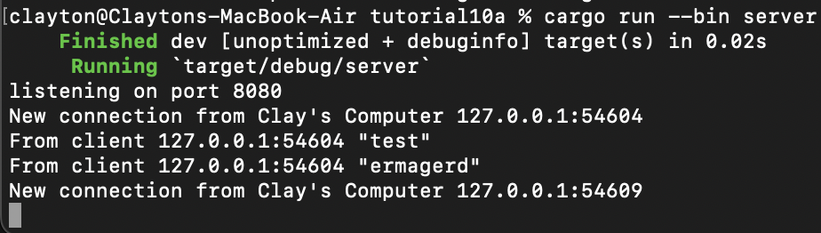
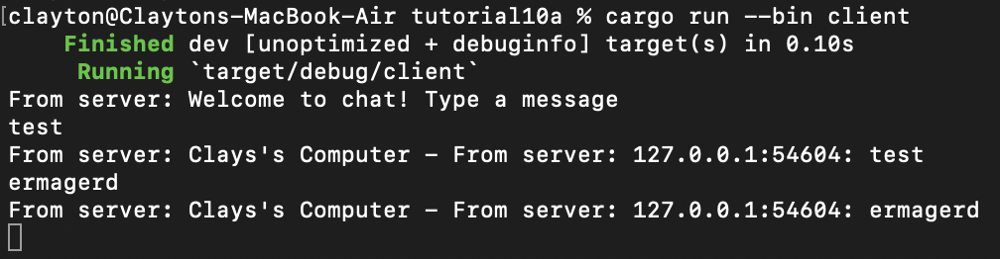

# Experiment 2.1: Original code, and how it run

On the top left there is the server, and the other three terminals are clients. When the server is opened on port 8080, it waits for a client to establish a connection. When this happens, the server identifies the client. When a client sends a message, it is sent to there server. Then, the server sends it to the rest of the clients.

# Experiment 2.2: Modifying port
In order to change the port to 8080, we have to ensure that the server and client are updated to connect to this port. To achieve this, we can update them in their respective files server.rs and client.rs. The other files use the same websocket protocol. It's defined in tokio_websockets.

# Experiment 2.3: Small changes, add IP and Port
[Make your own modification. Capture the result, put it in the Readme.md and put some explanation why you change it there]

To acheive a similar output to the example was string formatting the message variable. On the server side, I passed the address and text variables to a string before broadcasting them to the client. On the client side, it suffices to output just the text because the string is already formated by the server.